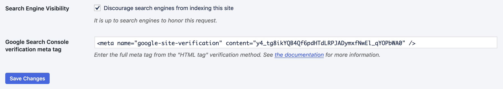
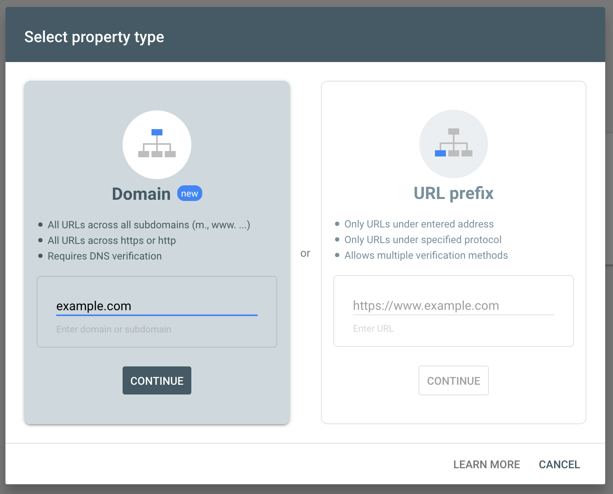

# Google Site Verification

To use the [Google Search Console](https://search.google.com/search-console/about) for your site, you need to verify your site with Google.

Altis includes built-in support for verifying your sites via the "HTML tag" method. Note that this process needs to be completed for each subdomain site if you have [multiple sites](docs://guides/multiple-sites.md).

If you have many sites, you may want to use the "Domain" (DNS) verification instead.

## Verifying via HTML tags

First, open the [Search Console](https://search.google.com/search-console/ownership). In the sidebar, select "Add Property".

In the modal window that appears, enter your site's domain into the "URL prefix" section.

Select "Continue". In the next window, select the "HTML tag" verification method.

Copy the meta tag from this screen, and enter it into the "Google Search Console verification meta tag" setting on the [Reading settings](internal://admin/options-reading.php) page.

Save this, and click "Verify" in Search Console. Your domain should now be verified in the console.

### Disabling the settings UI

With no verification tag entered, the site verification setting will have no effect on your site. If you're managing verification elsewhere, you may want to disable the setting UI as well.

This can be entirely disabled by setting `modules.seo.site-verification` to `false`.

## Verifying via Domain method (DNS)

Verifying via the Domain method allows your whole domain and all subdomains to be verified at once. This needs to be done via your DNS records.

First, open the [Search Console](https://search.google.com/search-console/ownership). In the sidebar, select "Add Property".

In the modal window that appears, enter your site's domain into the "Domain" section.

Select "Continue". In the next window, copy the TXT record.

If your domain's DNS is managed by Altis Cloud, contact support and provide this record along with the domain you entered.

If you manage your own DNS, set this TXT record in your DNS management console.

Select "verify later" once you have copied the record. After the DNS record has been added and has propagated, you can select this domain from the sidebar and select "verify" to complete the process.
